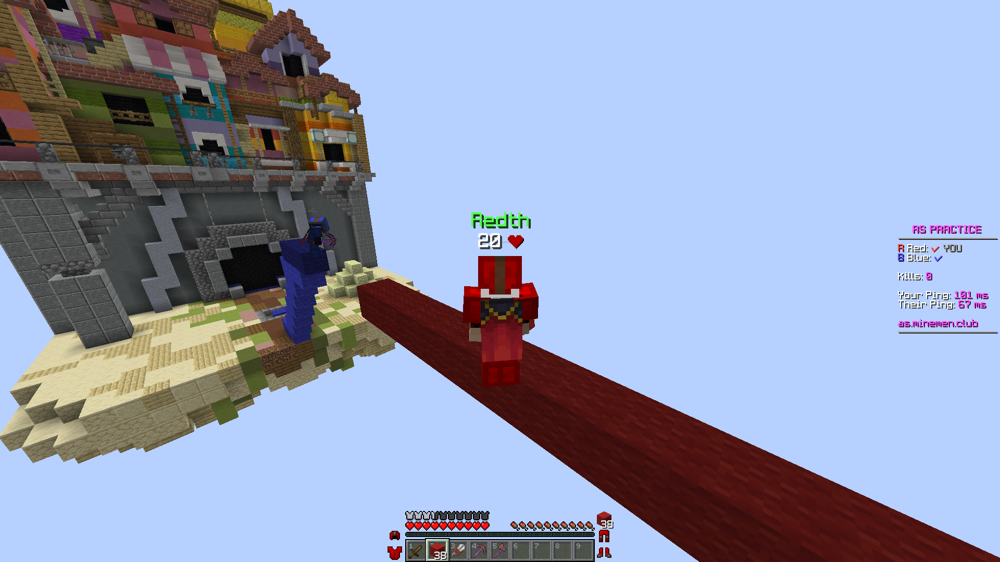
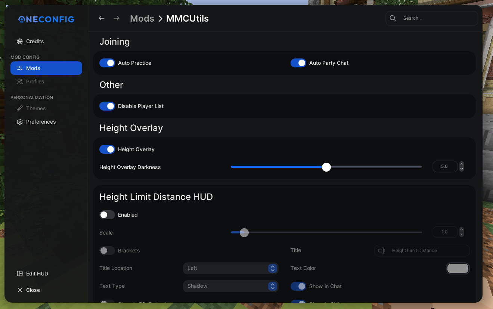

# MMCUtils
Utilities for Minemen Club

## Features
- **Auto Practice** - Go straight into practice once joined.
- **Auto Party Chat** - Enter party chat once joined practice.
- **Auto GG** - Send GG once a game ended.
- **Disable Player List** - Prevent accidentally tapping tab and lag your pc.
- **Height Overlay** - Make wools and terracottas darker at height limit.
- **Height Overlay Darkness** - Adjust the darkness of height limit overlay.
- **Height Overlay Distance HUD** - Shows how many blocks you are away from height limit.

Configurable in `OneConfig` menu

## Requirements
### Height Overlay
- OptiFine Smooth Lighting: On

## Images

